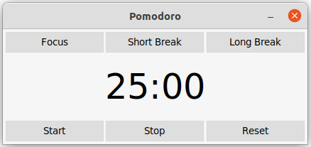

# Pomodoro
A Python Pomodoro with Tkinter and Threads

## Pomodoro Running



## How to run

```bash
$ python3 app.py
```

### Dependencies

- [tkinter](https://docs.python.org/3/library/tk.html)

```bash
$ apt install python3-tk